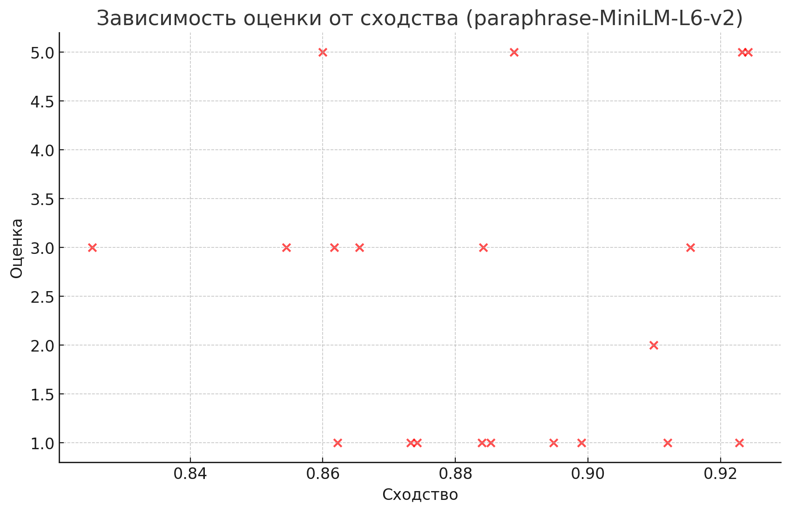
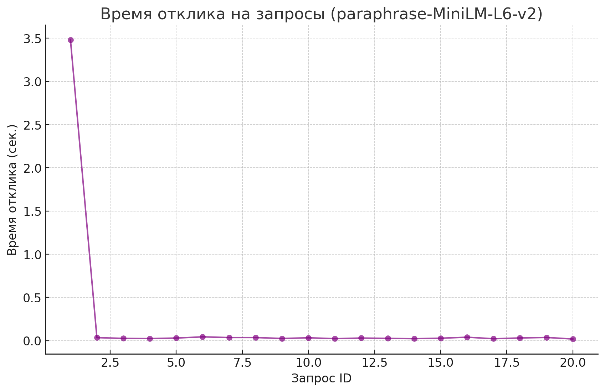
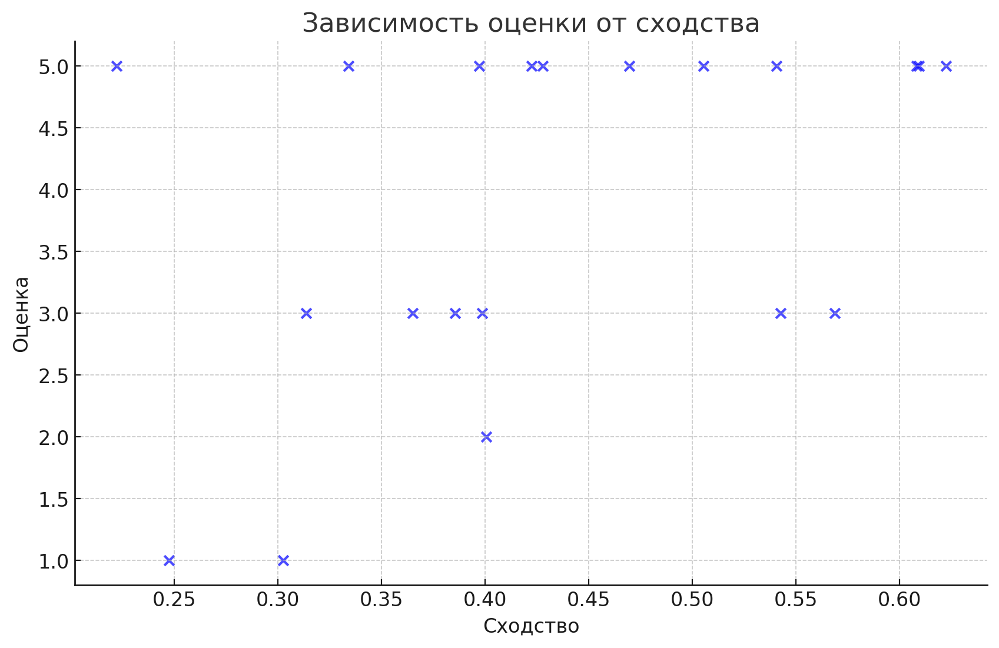
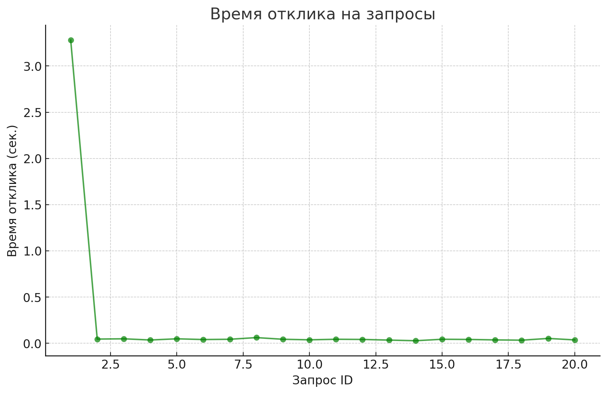
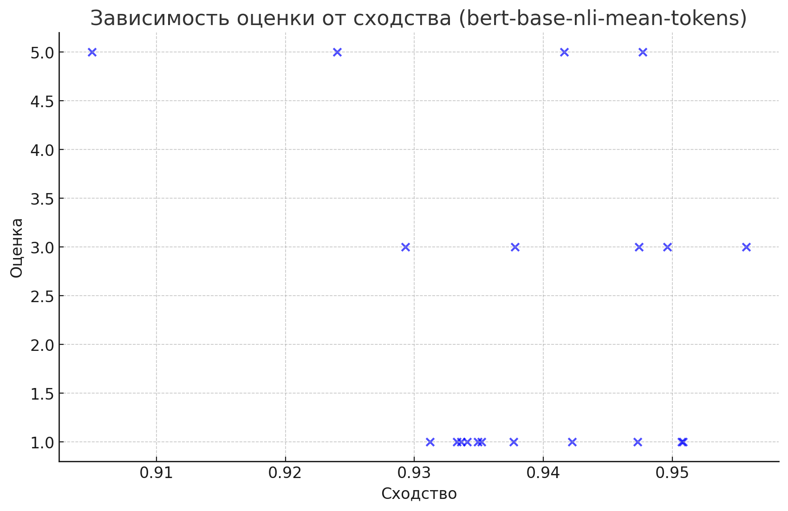
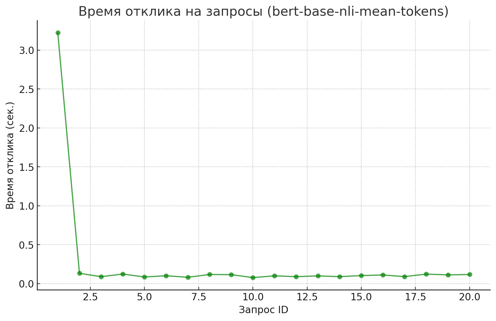

# EORA Project Chatbot

Чат-бот разработанный для предоставления информации о проектах, над которыми работала компания EORA. Бот поддерживает пользователей, отвечая на вопросы и предоставляя краткую информацию о решениях, реализованных EORA.

# Что сделано:
- Спарсил информацию о проектах с ссылок в тестовом файле.
- Реализовал асинхронного чат-бота на основе aiogram для работы с Telegram.
- Настроил базу данных PostgreSQL для хранения данных о проектах и облегчения асинхронного поиска релевантной информации + Alembic Миграции
- Использовал библиотеку pymorphy3 для обработки запросов пользователя с целью лемматизации, что улучшает поиск и повышает релевантность найденных данных.
- Настроил взаимодействие с моделью OpenAI GPT-3.5 Turbo для генерации кратких и "человеческих" ответов на вопросы пользователя на основе существующих данных о проектах.
- Использование эмбеддингов: Для улучшения поиска проектов используется преобразование текстов запросов и данных о проектах в эмбеддинги. Это позволяет сравнивать запросы пользователя с проектами на основе семантической близости, а не просто по ключевым словам.

## Что не сработало так, как хотелось бы:
- Интерфейс генерации ответов от OpenAI GPT-3.5 иногда выдает слишком длинные ответы, в которых слова обрываются, или ответы, которые не всегда точно соответствуют заданному вопросу. Например, если я спрашиваю, какие проекты вы делали для Додо, ответ может быть некорректным.
- Лемматизация и фильтрация по стоп-словам не всегда давали идеальные результаты, и в некоторых случаях некоторые релевантные проекты не попадали в итоговый список.

## Используемые технологии
- Python 3.11.9
- aiogram 3.10.0
- requests 2.32.3
- python-dotenv 1.0.1
- SQLAlchemy 2.0.20
- psycopg2-binary 2.9.7
- asyncpg 0.28.0
- Alembic 1.13.2
- OpenAI 1.51.0
- pymorphy3 2.0.2
- SentenceTransformers
- Poetry (для управления зависимостями)

## Использование OpenAI с прокси
В этом проекте вы можете использовать как прокси-API для взаимодействия с OpenAI, так и напрямую подключиться к их официальному API, в зависимости от настройки.

Переменные окружения
OPENAI_TOKEN: Токен API для доступа к OpenAI.

- Пример: OPENAI_TOKEN="sk-1g3CVHTghq8WWGB"
PROXYAPI_URL: (Опционально) URL прокси-сервера для работы с OpenAI.

- Пример: PROXYAPI_URL=https://api.proxyapi.ru/openai/v1
Если вы хотите использовать OpenAI напрямую, не указывайте эту переменную.

## Запуск проекта через Docker
Создайте файл .env в корневой директории проекта.  Пример:

```sh
OPENAI_TOKEN=sk-1g3CVHTghq8WsssssssssssssssssWGB
POSTGRES_DB=db
POSTGRES_USER=postgres
POSTGRES_PASSWORD=postgres
PROXYAPI_URL=https://api.proxyapi.ru/openai/v1
```
Запустите проект с помощью следующей команды:

```sh
docker compose -f docker-compose.yml up --build
```

Выполните Alembic миграции, чтобы инициализировать таблицы в базе данных. Для этого выполните следующую команду:

```sh
docker compose exec infra-eora-bot alembic upgrade head
```

### Обновления (13.10.2024):

## Использование эмбеддингов:

Для поиска проектов используются модели эмбеддингов, такие как SentenceTransformer, которые преобразуют запросы пользователей и данные о проектах в векторные представления (эмбеддинги). Это позволяет находить проекты на основе семантической близости.

### Сравнение производительности различных моделей эмбеддингов:
Для каждой из моделей было проведено тестирование с помощью 20 вопросов. После получения ответа на каждый вопрос, пользователю предлагалось оценить качество и точность ответа с помощью рейтинговой системы от 1 до 5. Эти оценки затем использовались для дальнейшего анализа точности каждой модели.

Пользовательская оценка в совокупности с параметром сходства, рассчитанным с использованием эмбеддингов моделей, позволила оценить общую эффективность каждой модели. Расчеты включали среднее значение пользовательских оценок, среднее значение сходства и времени отклика для каждой модели.

## paraphrase-MiniLM-L6-v2
это компактная и быстрая модель из семейства SentenceTransformers, предназначенная для нахождения парафразов (перефразированных предложений), то есть для задач, где нужно сравнивать текстовые запросы на предмет их семантической близости.

- Среднее сходство: 0.85
- Среднее время отклика: 0.054 сек.
- Средняя оценка от пользователей: 3.8/5





## distiluse-base-multilingual-cased-v2
Это многоязычная модель, которая поддерживает различные языки, в том числе русский, и предназначена для семантического поиска, классификации и извлечения смысловой информации из текста.

- Среднее сходство: 0.45
- Среднее время отклика: 0.048 сек.
- Средняя оценка от пользователей: 4.1/5






## bert-base-nli-mean-tokens
 Модель основана на архитектуре BERT и настроена для задач естественного языка (NLI — Natural Language Inference). Она преобразует предложения в векторы (эмбеддинги) и может быть использована для поиска и сравнения текстов на уровне предложений.

- Среднее сходство: 0.94
- Среднее время отклика: 0.112 сек.
- Средняя оценка от пользователей: 2.7/5







## Итог:
Наиболее быстрые ответы и высокая точность поиска наблюдались при использовании модели paraphrase-MiniLM-L6-v2. Однако, несмотря на низкое время отклика, модель bert-base-nli-mean-tokens показала низкую оценку со стороны пользователей, возможно, из-за возвращения нерелевантных результатов при высоком сходстве. Модель distiluse-base-multilingual-cased-v2 показала хороший баланс между точностью и скоростью ответа.
